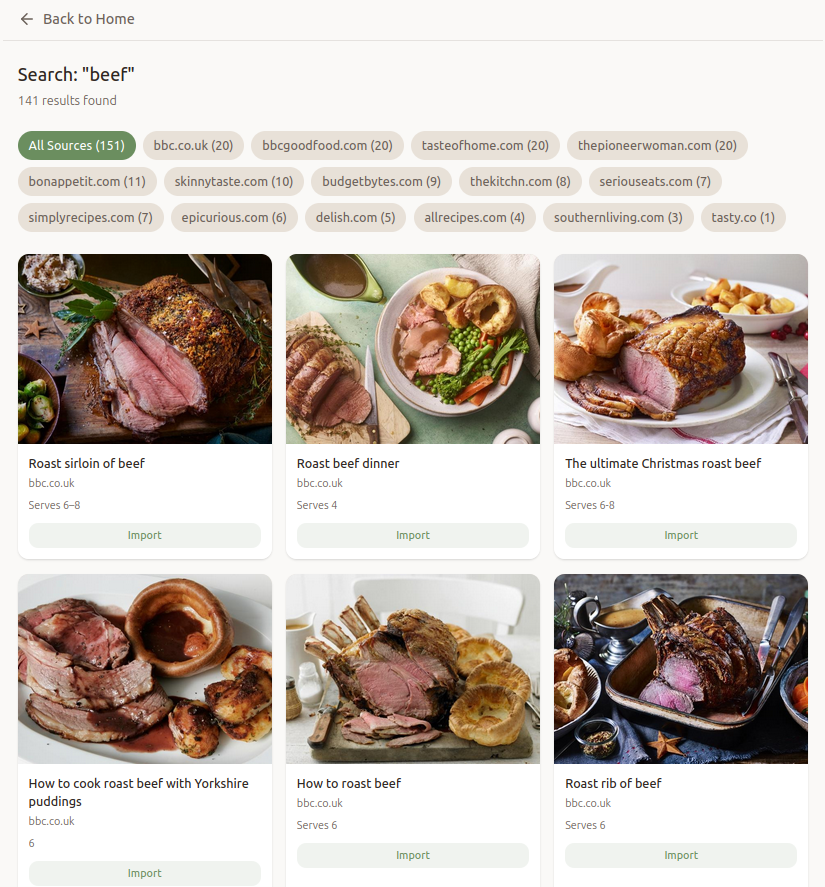
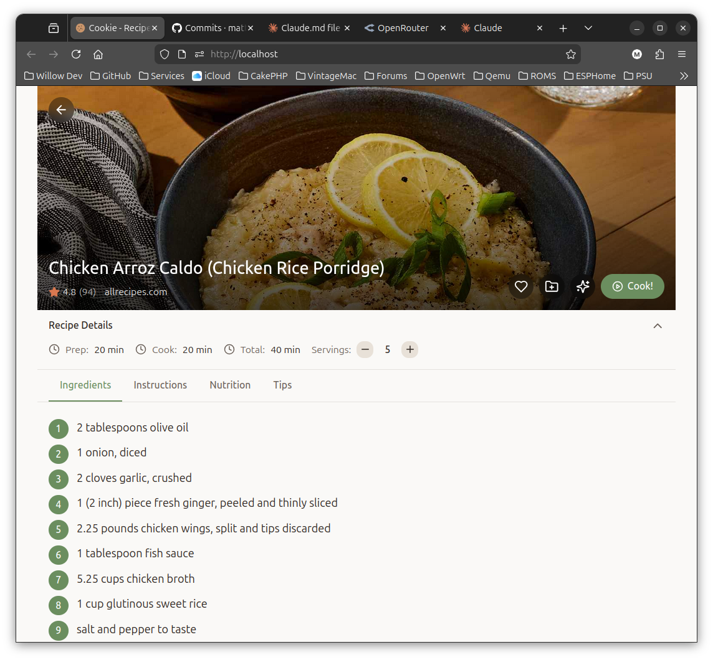
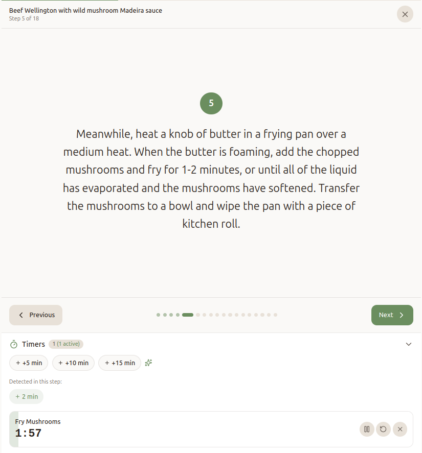
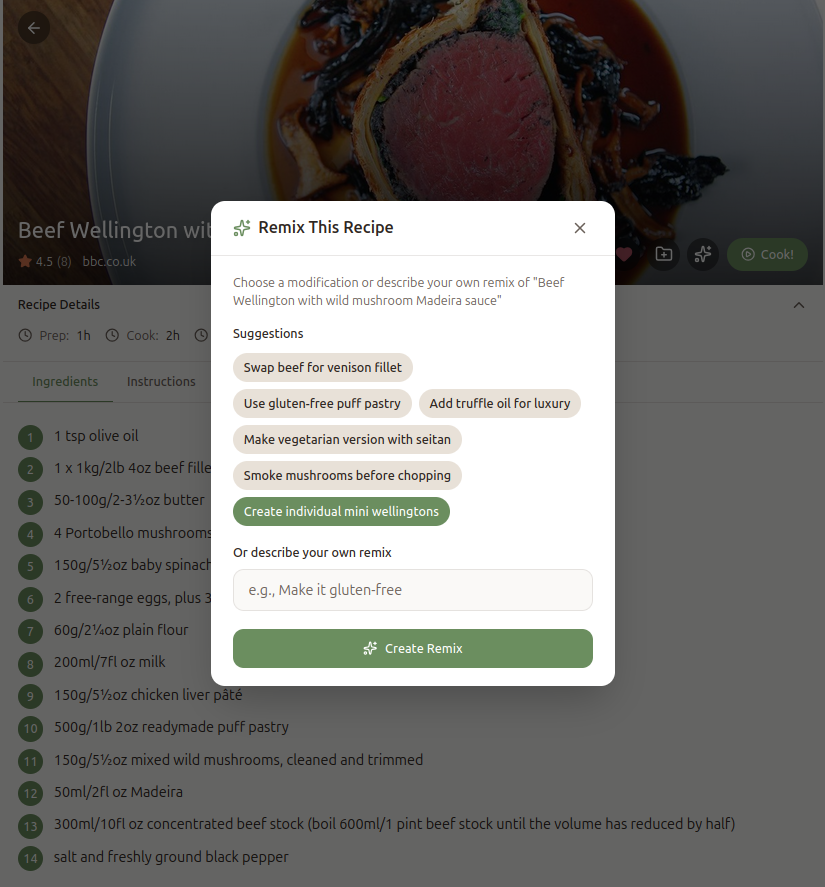
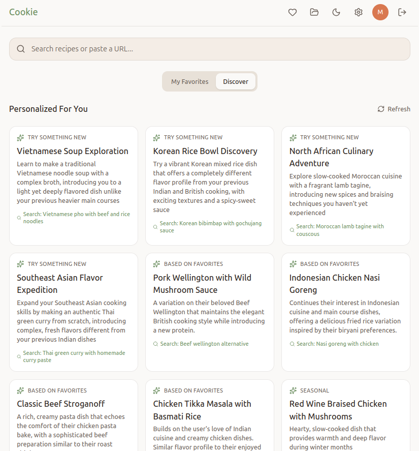
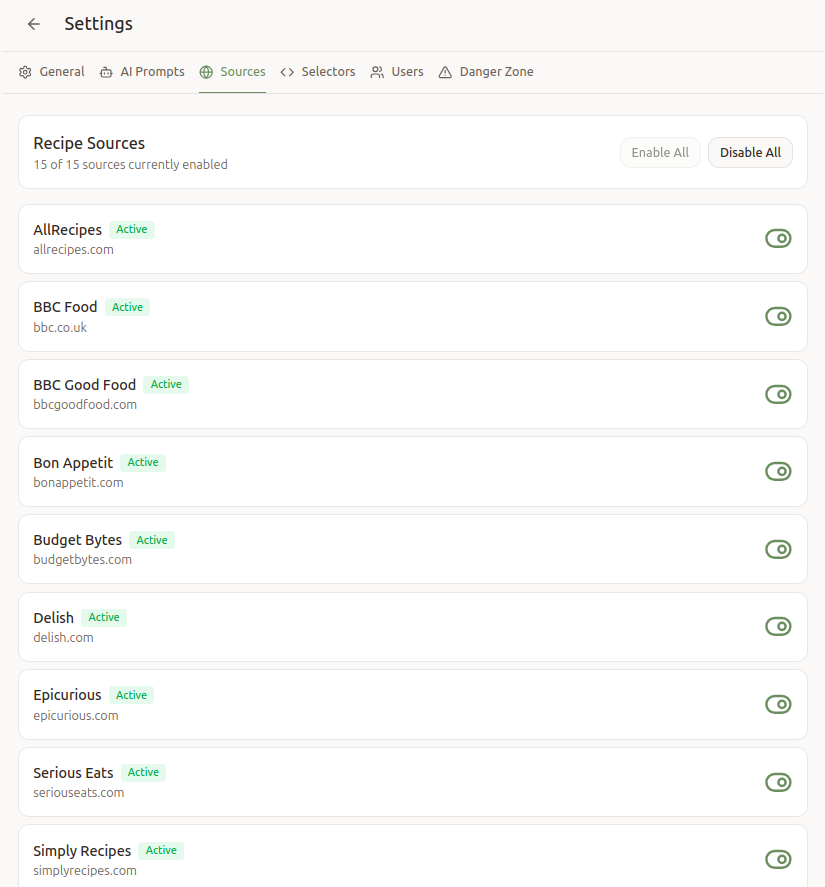

# Cookie

[](https://github.com/matthewdeaves/cookie/actions/workflows/ci.yml)
[](https://matthewdeaves.github.io/cookie/coverage/frontend/)
[](https://matthewdeaves.github.io/cookie/coverage/backend/htmlcov/)
[](https://matthewdeaves.github.io/cookie/coverage/)
[](https://matthewdeaves.github.io/cookie/coverage/)
[](https://matthewdeaves.github.io/cookie/coverage/)

A self-hosted recipe manager for searching, importing, organising, and cooking through recipes from popular cooking websites.

## Quick Start (Production)

Run the production container with a single command:

```bash
docker run -d -p 80:80 -v cookie-data:/app/data mndeaves/cookie:latest
```

Open http://localhost and start importing recipes.

**That's it.** Data persists in the `cookie-data` volume.

See [Deployment Guide](docs/DEPLOYMENT.md) for configuration options, updates, and network access.

## Quick Start (Development)

Clone and run the development stack:

```bash
git clone https://github.com/matthewdeaves/cookie.git
cd cookie
bin/dev up
```

Open http://localhost:3000 - hot reload enabled for both frontend and backend.

See [WORKFLOW.md](WORKFLOW.md) for development commands and testing with Claude Code.

## Screenshots

<table>
  <tr>
    <td align="center"><br><strong>Search</strong></td>
    <td align="center"><br><strong>Recipe</strong></td>
    <td align="center"><br><strong>Cook Mode</strong></td>
  </tr>
  <tr>
    <td align="center"><br><strong>AI Remix</strong></td>
    <td align="center"><br><strong>Discover</strong></td>
    <td align="center"><br><strong>Settings</strong></td>
  </tr>
</table>

<p align="center">
  <a href="docs/SCREENSHOTS.md"><strong>View full screenshot gallery</strong></a> including all features and legacy iPad support
</p>

## Features

**Import**
- Search 15 popular recipe sites simultaneously (AllRecipes, BBC Good Food, Serious Eats, Simply Recipes, Epicurious, Bon Appetit, Tasty, The Kitchn, Budget Bytes, Delish, Skinnytaste, Southern Living, The Pioneer Woman, Taste of Home, BBC Food)
- Import any recipe by URL
- Automatic extraction of ingredients, steps, and timings

**Organise**
- Multi-profile system (family members, dietary preferences)
- Collections and favorites
- Recipe notes and modifications

**Cook**
- Step-by-step cooking mode
- Built-in timers with audio alerts
- Wake-lock to keep screen on

**AI-Powered (optional)**
- Recipe remix suggestions
- Serving size adjustments with recalculated ingredients
- Cooking tips and substitutions
- Personalized discovery suggestions
- All AI features hidden when no API key configured

## Architecture

```
                    ┌───────────────────────────────────────────────────┐
                    │           Production Container                    │
   Port 80          │                                                   │
  ─────────────────►│ nginx                                             │
                    │  ├─ /api/, /admin/, /legacy/ ► gunicorn ─► Django │
                    │  ├─ /static/ ──► /app/staticfiles/                │
                    │  ├─ /media/ ──► /app/data/media/                  │
                    │  └─ / ──► React SPA (/app/frontend/dist/)         │
                    │                                                   │
                    │  Browser Detection:                               │
                    │  └─ iOS <11, IE, Edge Legacy ──► /legacy/         │
                    └───────────────────────────────────────────────────┘
                                         │
                                         ▼
                              ┌──────────────────┐
                              │  SQLite + WAL    │
                              │  /app/data/      │
                              └──────────────────┘
                                         │
                                         ▼ (optional)
                              ┌──────────────────┐
                              │   OpenRouter AI  │
                              └──────────────────┘
```

- Single container: nginx (port 80) + gunicorn (internal)
- Automatic legacy browser detection and redirect
- Dev/prod parity: both use nginx for routing

## Tech Stack

| Layer | Technology |
|-------|------------|
| Web Server | nginx (routing, static files, browser detection) |
| Backend | Django 5, django-ninja, gunicorn |
| Frontend | React 18, TypeScript, Vite, Tailwind |
| Legacy | ES5 JavaScript (iOS 9 compatibility) |
| Database | SQLite + WAL mode |
| AI | OpenRouter (Claude, GPT-4, Gemini) |
| Deployment | Docker (amd64, arm64), single container |

## Compatibility

- Modern frontend: any modern browser
- Legacy frontend: tested on iPad 3 (iOS 9.3.6 Safari)
- Responsive design for mobile, tablet, and desktop

## Configuration

### Environment Variables

| Variable | Required | Description |
|----------|----------|-------------|
| `DEBUG` | No | Set to `false` in production (default) |
| `ALLOWED_HOSTS` | No | Comma-separated hostnames (default: `*`) |
| `CSRF_TRUSTED_ORIGINS` | No | Full URLs for CSRF protection |
| `SECRET_KEY` | No | Auto-generated if not set |

AI features are configured through the Settings UI, not environment variables.

### Data Persistence

```bash
# Docker volume (recommended)
docker run -v cookie-data:/app/data mndeaves/cookie:latest

# Or bind mount
docker run -v /path/to/data:/app/data mndeaves/cookie:latest
```

Data stored in `/app/data`:
- `db.sqlite3` - SQLite database
- `media/` - Uploaded images
- `.secret_key` - Auto-generated Django secret key

## Data Privacy

- Fully self-hosted - all data stays on your server (apart from when using OpenRouter)
- SQLite database stored locally
- No telemetry or external tracking
- AI requests go to OpenRouter only if configured

## Basic Usage

1. **Import recipes**: Search across 15 sites or paste any recipe URL
2. **Organise**: Create profiles for family members, add recipes to collections
3. **Cook**: Open a recipe and enter cooking mode for step-by-step guidance
4. **AI features**: Add an OpenRouter API key in Settings to enable remix suggestions, cooking tips, and personalized discovery

## Development

### Prerequisites

- Docker and Docker Compose

### Getting Started

```bash
git clone https://github.com/matthewdeaves/cookie.git
cd cookie
bin/dev up        # Start development stack on port 3000
```

### Development Commands (`bin/dev`)

```bash
bin/dev up              # Start development stack (port 3000)
bin/dev down            # Stop development stack
bin/dev logs -f         # Follow logs
bin/dev test            # Run pytest
bin/dev shell           # Django shell
bin/dev migrate         # Run migrations
bin/dev npm test        # Run frontend tests
```

### Production Commands (`bin/prod`)

```bash
bin/prod up             # Start production container (port 80)
bin/prod down           # Stop production container
bin/prod pull           # Pull latest image from Docker Hub
bin/prod update         # Pull and restart
bin/prod logs -f        # Follow logs
bin/prod health         # Check container health
bin/prod build          # Build production image locally
```

### Port Configuration

| Environment | Port | URL |
|-------------|------|-----|
| Development | 3000 | http://localhost:3000 |
| Production  | 80   | http://localhost |

## Code Quality

15-job CI pipeline (path filters skip docs/markdown):

**Frontend (7 jobs):** lint (ESLint), typecheck (TypeScript), test (Vitest), complexity, duplication, security (npm audit), bundle analysis

**Backend (5 jobs):** lint (ruff), test (pytest), complexity (radon), duplication (jscpd), security (pip-audit)

**Legacy (2 jobs):** lint (ESLint ES5), duplication (jscpd)

**Final (1 job):** ci-success aggregator

- [Quality Dashboard](https://matthewdeaves.github.io/cookie/coverage/) - comprehensive metrics with live data and detailed reports
- [Metrics JSON API](https://matthewdeaves.github.io/cookie/coverage/api/metrics.json) - programmatic access to all metrics
- Automated dependency updates via Dependabot (weekly for pip, npm, GitHub Actions)
- Auto-generated GitHub releases with categorized changelog on version tags

## Documentation

- [Deployment Guide](docs/DEPLOYMENT.md) - Production deployment, configuration, reverse proxy setup
- [Architecture](docs/ARCHITECTURE.md) - System design, data models, API structure
- [AI Features](docs/AI-FEATURES.md) - AI capabilities, configuration, customization
- [Screenshots](docs/SCREENSHOTS.md) - Full visual tour of modern and legacy frontends
- [WORKFLOW.md](WORKFLOW.md) - Development workflow and commands
- [plans/](plans/) - Implementation planning documents

## License

MIT
